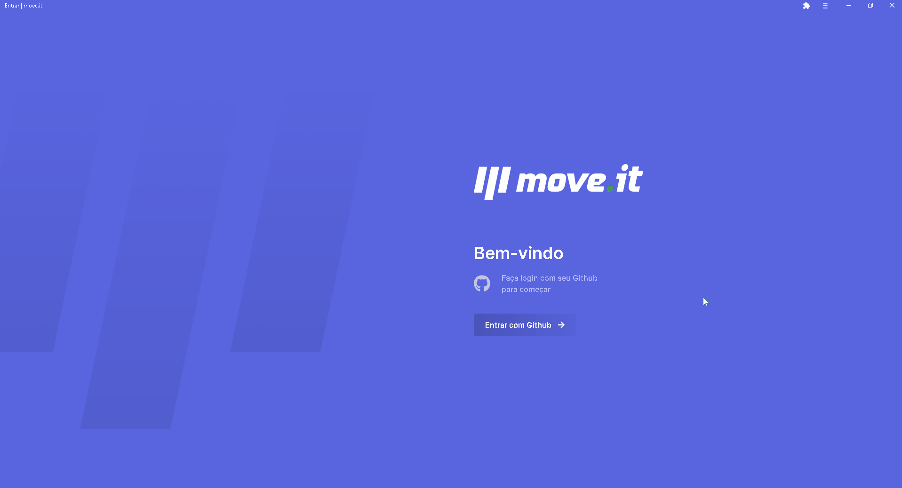

<h1 align="center">
  
</h1>

## **<h2 align="center">[Front end application](https://move-it-nlw04-nine.vercel.app/)  💻</h2>**

## 
<h2 align="center">An app that reminds you to exercise every 25 minutes, based on the Pomodoro technique developed in #NLW04 delivered by [Rocketseat](https://app.rocketseat.com.br/dashboard)</h2> 

  <a href="#computer-demonstration-of-the-application">Demonstration of the application</a>&nbsp;&nbsp;&nbsp;|&nbsp;&nbsp;&nbsp;
  <a href="#star-features">Features</a>&nbsp;&nbsp;&nbsp;|&nbsp;&nbsp;&nbsp;
  <a href="#rocket-technologies-used">Technologies used</a>&nbsp;&nbsp;&nbsp;|&nbsp;&nbsp;&nbsp;
  <a href="#information_source-application-installation">Application installation</a>

# :computer: Demonstration of the application

  

 

<h3 align="center"> 
	Application status: Developed ✔️
</h3>
 

<h3 align="center">
   In addition to developing the initial application offered in the classes, I added more features to the application, such as:
</h3>

###
* Responsive layout
* Page 404 - Page not Found
* Github OAuth Authentication
* Leaderboard of active users in the app
* Page of users who are ranking containing user data on Github and move.it
* Generation of static pages of users
* PWA

<h2 align="center"> 
	Web application: https://move-it-nlw04-nine.vercel.app/
</h2>
 

## :star: Features
- [x] Accountant reporting that it's time to focus on work or studies 
- [x] At the end of time, a challenge is randomly generated to complete
- [x] Level, experience and total completed challenge information
- [x] If a challenge is complete, the user gains experience, if he does not complete the challenge, the counter resets again
- [x] Responsive layout
- [x] Page 404 - Page not Found
- [x] Github OAuth Authentication
- [x] Leaderboard of active users in the app
- [x] Page of users who are ranking containing user data on Github and move.it
- [x] PWA

## :rocket: Technologies used:

 

## :information_source: Application installation
- `git clone https://github.com/mathwcruz/move.it_nlw04.git` to clone the repository

 

# 🎲 Run web application
To run the application on the web, follow the instructions from your terminal:
- `cd move.it_nlw04` and `code .`
- run `yarn` to install the dependencies of the project
- After that, run `yarn dev` to run the application, will open at the address `localhost:3000`
 

# 🎲 Run server
To run the server, follow the instructions from your terminal:
- `cd move.it_nlw04` and `code .`
- `yarn server`, will open at the address `localhost:3333`
- You also need to configure these environment variables inside of `.env.local` file at your root directory app:
- ` GITHUB_CLIENT_ID, GITHUB_CLIENT_SECRET and NEXTAUTH_URL `

### Author
---

<a href="https://app.rocketseat.com.br/me/matheus-da-cruz-frontend">
 
  
 <b>Matheus da Cruz</b></a> <a href="https://app.rocketseat.com.br/me/matheus-da-cruz-frontend" title="Rocketseat">  🚀</a>

Desenvolvido por Matheus da Cruz 😊

 

 

### 
 <h2 align="center">Another application developed by Matheus da Cruz 👨‍💻 </h2> 

